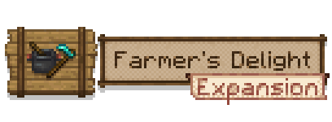

# Farmer's Delight Expansion

### [Modrinth](https://modrinth.com/mod/farmers-delight-expansion)

## Overview

**Farmer's Delight Expansion** is a mod made to add new foodstuffs, plants and quality of life changes to the Farmer's Delight mod and Minecraft itself.

**NOTICE!** The mod will rarely be updated, as life has been busy for me.

## Features
* Achievements relating to Farmer's Delight & This Mod
* Better Crop Drops (e.g. Apple, Rice)
* Fruits, Juices, Foods & Sweets
* Eggs stack all the way to 64

Like Apples, you can find oranges in birch leaves, grapes and blueberries in spruce leaves (you can replant them like berry bushes).

## Links
**IMPORTANT!** Please make sure to install [Farmer's Delight Refabricated](https://modrinth.com/mod/farmers-delight-refabricated)!

If there are any issues with the mod, report them to the [issue tracker](https://github.com/keishispl/farmers-delight-expansion/issues).

## Contributing

Thank you for visiting the repository! If you'd like to contribute with the mod, feel free to check the wiki for more details, or take a look at the issues page!

I am open to constructive feedback about the mod's code: if you spot any mistakes in my code, and/or you know a better way to accomplish something, feel free to open an issue/PR about it. Any help is appreciated!

## FAQ

Expand for FAQ

**Q. Which Minecraft versions will the mod be updated for?**

Versions that Farmer's Delight will be updating to. I will not be supporting older versions of Farmer's Delight.

**Q. Can I use this mod into my modpack?**

Yes! Feel free to feature Farmer's Delight Expansion in your modpack. Just keep in mind:

- Make sure to credit, and don't claim Farmer's Delight Expansion as your own creation;
- Remember that this mod requires the fabric version of Farmer's Delight, so remember to download it first!

**Q. Will new features be added to the mod?**

Yes, if I have ideas to implement, or feel free to suggest your own ideas!

